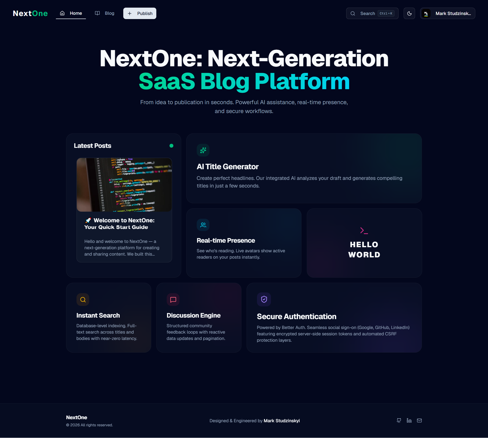
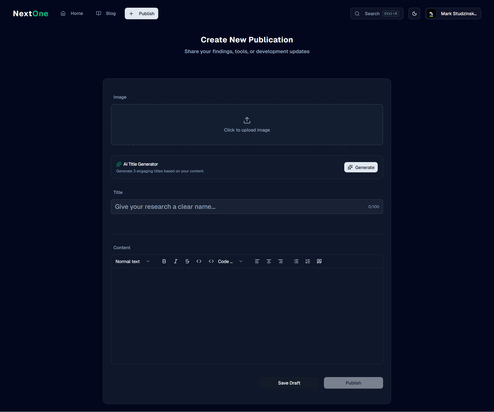
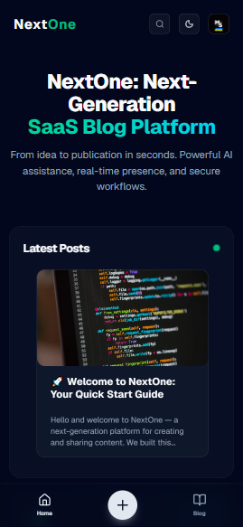
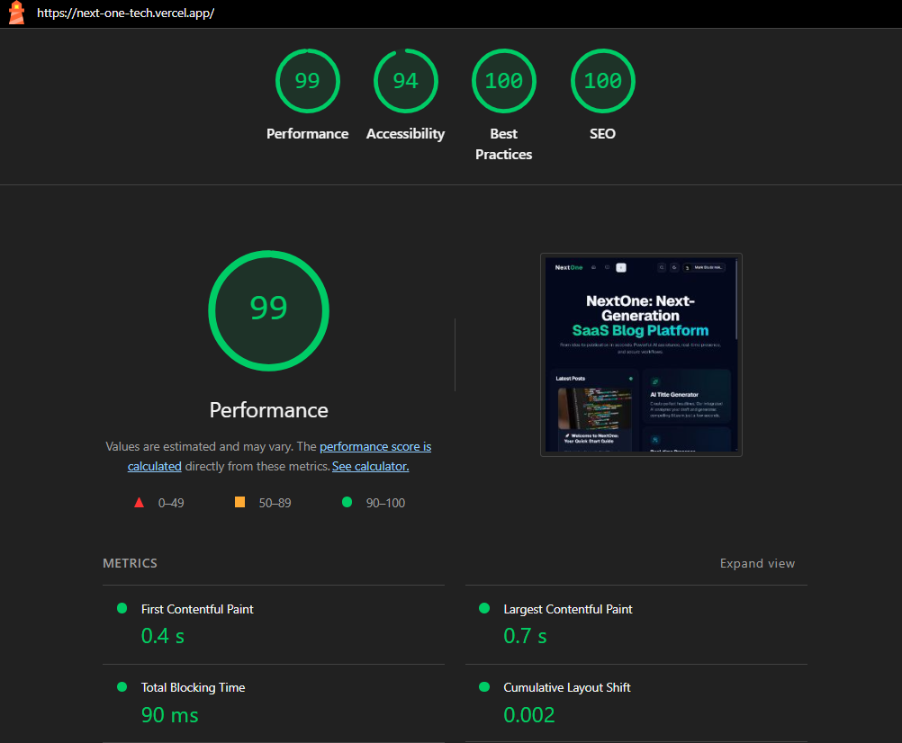

# 🚀 NextOne

[](https://nextjs.org/)
[](https://react.dev/)
[](https://www.typescriptlang.org/)
[](https://tailwindcss.com/)
[](https://convex.dev/)
[](https://www.better-auth.com/)

[](https://next-one-tech.vercel.app/)

A full-stack publishing platform using a pragmatic Feature-Sliced Design, with real-time sync and AI-assisted workflows.

## 1. Header & Badges

**[🌐 Live Demo URL](https://next-one-tech.vercel.app/)**

<p align="center"></p>

<p align="center"></p>

<p align="center"></p>

<p align="center">

</p>

<p align="center">

</p>

## 2. 🧐 Provenance & "Beyond the Tutorial"

The project's foundational authorization patterns and core live sync blocks were initially inspired by the open-source repository: "Next.js 16 Full Stack Course" by Jan Marshal (ski043) (https://github.com/ski043/nextjs-16-yt).

### How this project goes beyond the tutorial

- **Architecture (Pragmatic FSD Scaling):** The tutorial implemented a flat, tightly-coupled workspace folder organization. I re-engineered the repository into a **Pragmatic Feature-Sliced Design (FSD)**. Instead of textbook FSD over-engineering, I adapted a simplified version optimized for release velocity and future scaling, isolating domain logic into `features/` (`auth`, `comments`, `editor`, `presence`, `search-posts`), decoupled semantic layouts into `widgets/`, and preserved stateless UI elements in `components/`.
- **AI-Driven Workflows:** The reference tutorial contained no AI utilities. I architected and integrated a custom AI Title Generator inside `features/ai-title-generator` utilizing the Groq API coupled with robust backend Convex server actions and operational daily rate-limiting trackers (`aiDailyLogs` schema table).
- **Comprehensive Testing Strategy:** The reference code entirely lacked validation layers. I built a comprehensive testing suite from scratch, implementing **Vitest** for isolated state and utility unit testing alongside comprehensive multi-device **Playwright** scripts covering complete automated End-to-End (E2E) login, publishing, and real-time comment user journeys.
- **Production-Grade SEO & Web Quality:** Implemented server-side SEO and discovery features, creating dynamic sitemap algorithms via `app/sitemap.ts`, crawlers filtering via `app/robots.ts`, and caching dynamic site configurations. Verified via Google Lighthouse metrics (for example: ~99 Performance / ~94 Accessibility on core marketing pages and ~83 Performance / ~96 Accessibility on complex rich-text publication streams).
- **UX improvements and polish:** Replaced rigid raw browser render states with `shadcn/ui` skeleton loaders across dynamic data flows, introduced client-and-server data schemas with Zod validations, and deployed custom Error Boundaries along with semantic 404 views.

## 3. 🛠 Core Tech Stack Matrix

| Technology        | Implementation Purpose                                                   |
| ----------------- | ------------------------------------------------------------------------ |
| Next.js 16.1.6    | App Router, Server Actions, and `use cache` integration                  |
| React 19.2.3      | Component-driven UI runtime for the experience layer                     |
| Convex 1.31.7     | Reactive queries, mutations, and file storage for the real-time platform |
| Better Auth 1.4.9 | Multi-provider adapter integration for secure session flows              |
| TailwindCSS v4    | Modern OKLCH-driven styling system for the design language               |
| TipTap Editor     | Rich text engine for the publishing workspace                            |
| Groq API          | AI LLM orchestration for automated title generation                      |
| Vitest            | Isolated unit specs for feature and utility validation                   |
| Playwright        | End-to-end headless automation for multi-device regression coverage      |

## 4. ✨ Production-Grade Features

- 📝 **Advanced Rich Text Workspace:** TipTap-powered creation flow backed by pre-signed secure image upload tokens mapped to Convex storage instances.
- 🤖 **Groq AI Co-Writer:** Interactive metadata assistance providing 3 contextual header variations with server-enforced daily limits per user session.
- 👥 **Reactive Live Presence:** Sub-second heartbeat synchronization utilizing `@convex-dev/presence` to render real-time reader avatar facepiles on active posts.
- 🔐 **Auth & Sessions:** Supports username/password and OAuth providers (GitHub, Google, LinkedIn) using HTTP-only cookie sessions. Security hardening (email verification, RBAC, rate limiting) is in progress — see Known Limitations below.
- 🔍 **Database-Level Full-Text Search:** Scalable data mining execution over indexed post structures using multi-field relevance scoring via Convex search pipelines.

## Known Limitations

- **Security hardening in progress:** Core features are implemented, but several security controls are still being finalized (email verification flows, RBAC enforcement, and endpoint rate limiting). Treat the current deployment as a functional demo rather than a fully audited production system.
- **Testing coverage scope:** Unit tests and E2E scripts cover the main user flows (auth, publishing, comments), but some edge-case integrations (third-party OAuth failure modes, AI gateway throttling fallbacks) have limited test coverage.
- **Operational considerations:** Multi-region scaling, formal disaster recovery, and hard SLA commitments are not yet implemented — these are planned in the roadmap (see v1.3).

## 5. 🏗 Structural Design (Pragmatic FSD)

The project uses a simplified, pragmatic adaptation of Feature-Sliced Design. Layers such as `shared/` were intentionally kept consolidated within `components/` for the MVP to maintain high release velocity, while `features/` provides strict enough isolation for future scaling.

```text
app/                # Route-level pages, layouts, SEO handlers, auth entry points
features/           # Isolated domain features: auth, comments, editor, presence, search-posts
widgets/            # Composed landing/layout blocks that assemble features and UI primitives
components/         # Stateless UI primitives and shared layout elements
convex/             # Reactive backend functions, schema, auth adapters, AI actions, presence logic
```

## 6. 🧠 Technical Challenges & Solutions

### 1. Architectural Pragmatism: Adapting Feature-Sliced Design (FSD)

- **Challenge:** The project originated from a monolithic, standard Next.js folder structure which risked becoming tightly coupled as complex features (like real-time presence and AI text processing) were added. However, implementing strict, textbook FSD for a v1.0 release can introduce unnecessary boilerplate and slow down the delivery velocity.
- **Solution:** Transitioned to a **Pragmatic Feature-Sliced Design (FSD)**. Rather than strictly adhering to textbook rules, I implemented a simplified version isolating critical business logic into `features/` (e.g., `auth`, `editor`, `presence`) and `widgets/`, while keeping UI primitives grouped in `components/`. This specific architectural compromise balanced rapid release velocity for the MVP with the strict module decoupling required for future enterprise scaling.

### 2. State Synchronization & Auth Boundaries (Convex + Better-Auth)

- **Challenge:** Managing distributed responsibilities between Convex (as a reactive real-time database) and Better-Auth (for session management) without introducing redundant network roundtrips, database bloat, or race conditions during server-side renders.
- **Solution:** Implemented a lightweight proxy layer and precise multi-layered authorization guards. Instead of bloated custom syncing hooks, the schema leverages clean separation where Convex handles reactive primitives (like full-text search and real-time facepiles) and pairs seamlessly with Better-Auth tokens to achieve instantaneous UI hydration while reducing the risk of unintended data exposure on critical server mutations; see Known Limitations.

### 3. Mobile-First Ergonomics & Performance Engineering (Lighthouse 95+)

- **Challenge:** Full-stack rich text editors and live web websockets typically degrade mobile experiences, causing high Cumulative Layout Shift (CLS) and awkward navigation layout ergonomics.
- **Solution:** Designed a custom mobile-first viewport architecture featuring a native-feeling persistent bottom navigation bar for high-reach thumb ergonomics. Optimized asset deliveries and script evaluations to secure perfect Lighthouse scores across desktop views (both for the static landing system and high-density dynamic blog routes), combining production-grade SEO parameters with immediate interaction times (TTI).

## 7. 🚀 Local Installation & Setup

```bash
git clone https://github.com/StudzinskyiMark/NextOne.git
pnpm install
```

```bash
# Convex Cloud Core
NEXT_PUBLIC_CONVEX_URL=https://your-deployment.convex.cloud
NEXT_PUBLIC_CONVEX_SITE_URL=https://next-one-tech.vercel.app
CONVEX_DEPLOYMENT=prod:your-deployment-name

# Better Auth Secrets
BETTER_AUTH_SECRET=your_auth_secret_string
SITE_URL=https://next-one-tech.vercel.app

# Third-Party API OAuth & AI Gateways
GITHUB_CLIENT_ID=your_github_id
GITHUB_CLIENT_SECRET=your_github_secret
GROQ_API_KEY=your_groq_key

# Automation & Testing Protocols
TEST_API_KEY=your_e2e_cleanup_bearer_token
TEST_USER_EMAIL=e2e-test@nextone.com
TEST_USER_PASSWORD=YourPassword123!
```

```bash
npx convex dev # Sync database schemas and mutations
pnpm dev       # Run local Next.js client engine
```

## 8. 📈 Strategic Product Roadmap

- [ ] **v1.1 (Security Hardening & Strict FSD Migration):** Enforce strict mandatory email verification pipelines via Resend integration, activate full Role-Based Access Control (RBAC - Admin, Author, Reader scopes) at the Convex schema layer, implement endpoint rate-limiting using distributed infrastructure (Upstash Redis), and migrate the pragmatic FSD architecture into strict FSD (extracting `shared/` layer).
- [ ] **v1.2 (User Retention & Workspace Experience):** Launch personalized User Dashboards containing interactive publication matrices (likes, bookmark tracking), introduce safe post-publishing editing cycles, and build a hybrid local-storage draft persistence cache engine.
- [ ] **v1.3 (Global Scale):** Integrate localized routing rules via `next-intl` targeting English and Ukrainian markets accompanied by optimized regional multi-language metadata mapping.

## 9. 📝 Engineering Contact

- **Developer:** Mark Studzinskyi
- **LinkedIn:** https://www.linkedin.com/in/mark-studzinskyi/
- **Email:** mark.studzinskiy@gmail.com
